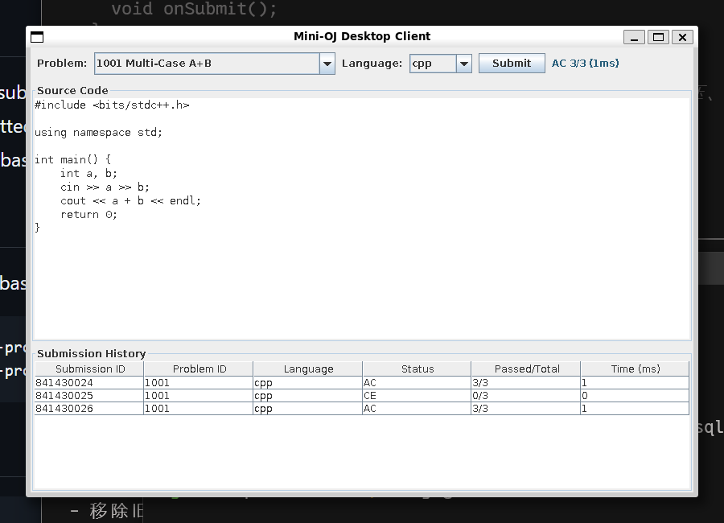

# Mini-OJ

Mini-OJ 是一个教学向本地在线判题系统，使用 Java Swing、MySQL/JDBC
和外部 C++ 判题机实现。当前已完成 M6 工程收官阶段，支持多线程并发判题。



## 功能

- Swing 桌面客户端：选题、选择语言、编辑源码、提交和查看历史
- C++、Python 源码编译或执行
- 外部 C++ 判题机提供时间、内存和进程级隔离
- MySQL 保存题目元数据与提交历史
- 文件系统保存测试点和提交源码
- 泛型有界阻塞队列提供背压
- 4 个守护工作线程并发消费判题任务
- 支持 AC、WA、TLE、MLE、RE、CE、PE 状态

## 架构

```text
OjController / SwingWorker
          |
          v
JudgeQueue<JudgeTask>
          |
          v
JudgeWorker x 4
    |             |
    v             v
MachineJudge   SubmissionDao
    |             |
    v             v
C++ judge       MySQL
```

数据职责：

- MySQL：题目元数据、提交结果
- `problems/`：测试点
- `submissions/`：选手源码
- `ProblemService`：合并数据库元数据与文件系统测试点

## 环境要求

- Linux
- JDK 11 或更高版本
- GCC/G++，支持 C++17
- Python 3
- MySQL 8
- MySQL Connector/J，已放在 `lib/`

## 数据库

默认连接配置：

```text
host: 127.0.0.1
port: 3306
database: minioj
username: root
password: root
```

初始化数据库和样题：

```bash
mysql -h127.0.0.1 -P3306 -uroot -proot < schema.sql
mysql -h127.0.0.1 -P3306 -uroot -proot < sample-data.sql
```

当前环境使用 Docker 容器时，先启动 MySQL：

```bash
docker start mysql-house
```

## 编译运行

编译 C++ 判题机：

```bash
make -C judge
```

编译 Java：

```bash
javac -cp "lib/*" -d build $(find src -name '*.java')
```

启动桌面客户端：

```bash
java -cp "build:lib/*" oj.gui.Main
```

也可以使用兼容入口：

```bash
java -cp "build:lib/*" oj.Main
```

## 项目结构

```text
Mini-OJ/
├── judge/                  # C++ 判题机
├── lib/                    # JDBC 驱动
├── problems/<id>/          # N.in / N.out 测试点
├── submissions/            # 提交源码，运行时生成
├── src/oj/
│   ├── core/               # Problem、Submission、JudgeTask 等模型
│   ├── db/                 # Db、ProblemDao、SubmissionDao
│   ├── gui/                # Swing View、Controller 和入口
│   ├── io/                 # 配置及测试点加载
│   ├── judge/              # MachineJudge
│   │   └── queue/          # JudgeQueue、JudgeWorker
│   └── service/            # ProblemService
├── schema.sql              # 数据库结构
└── sample-data.sql         # 样题元数据
```

## 并发判题流程

1. GUI 创建 `JudgeTask`。
2. `SwingWorker` 将任务放入有界 `JudgeQueue`。
3. 空闲的 `JudgeWorker` 取出任务并保存源码。
4. `MachineJudge` 启动外部 C++ 判题进程。
5. Worker 将结果写入 MySQL，并调用 `task.complete()`。
6. `SwingWorker.done()` 在 EDT 更新状态和历史表格。

队列满时生产者会等待，防止任务无限堆积。Worker 异常会转换为 RE，不会导致
工作线程退出。

## 样题

| ID | 题目 |
|---:|---|
| 1001 | Multi-Case A+B |
| 1002 | Maximum of Three |
| 1003 | Sum from 1 to N |
| 1004 | Leap Year Check |

## 常见问题

### 数据库加载失败

确认 MySQL 已启动：

```bash
docker start mysql-house
mysql -h127.0.0.1 -P3306 -uroot -proot minioj
```

### 找不到 JDBC 驱动

运行 Java 时必须包含 `lib/*`：

```bash
java -cp "build:lib/*" oj.gui.Main
```

### 找不到判题机

重新编译：

```bash
make -C judge
```

## 教程

[Mini-OJ Tutorial](https://winbeau.github.io/Mini-OJ-docs/mini-oj-tutorial.html)
